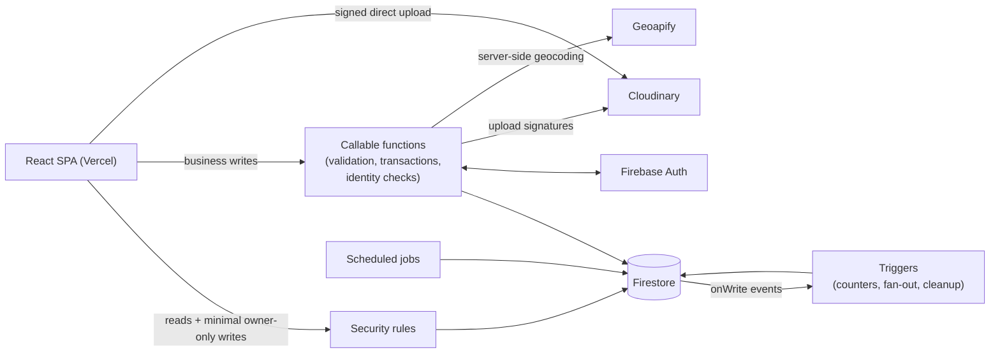

# PetNote

A pet-centric social web app: feeds, pet profiles with shared family access, pet-friendly places with reviews and check-ins, and meetups — built on React 19 and a callable-first Firebase backend.

**Live demo:** https://petnote.vercel.app


*The feed — posts, pets, and the check-in tabs*

## Features

- Social feed with image/video posts, comments and replies, likes, bookmarks, and hashtag discovery
- Pet profiles with multi-user "family" access granted through single-use invitation codes
- Pet-friendly places with ratings, reviews, photos, and media check-ins
- Meetups with capacity/eligibility checks and private-address handling
- Real-time notifications fanned out server-side; admin moderation (reports, warnings, bans)
- Full account lifecycle including server-orchestrated account deletion

## Tech stack

| Layer | Technology |
| --- | --- |
| Frontend | React 19, TypeScript 5.9, Vite 7, Tailwind CSS 4, React Router 7 |
| Backend | Firebase Auth, Firestore, Cloud Functions v2 (TypeScript, Node 22) |
| Security | Firestore rules + callable-first writes, custom-claim roles, server-side rate limiting |
| Media | Cloudinary, browser-direct uploads with server-issued signatures |
| Geocoding | Geoapify, proxied through Cloud Functions (no client-side key) |
| Quality | Vitest, ESLint, strict TypeScript |
| Hosting | Vercel (web), Firebase (rules + 62 Cloud Functions) |

## Architecture

The client never writes business data directly. Firestore rules allow reads and a small set of schema-locked owner-only writes; every other write goes through callable Cloud Functions, and derived data (counters, notification fan-out, cleanup) is maintained by Firestore triggers and scheduled jobs.



62 Cloud Functions across 11 domain modules ([functions/src](functions/src)): posts, comments, pets, family invitations, follows, places/reviews/check-ins, meetups, notifications, moderation, media, and account lifecycle.

## Implementation notes

### Idempotent account deletion with a tombstone guard

Deleting an account cascades across a dozen collections (posts, comments, likes, follows, check-ins, meetup participation, …) via collection-group queries backed by explicit field overrides in [firestore.indexes.json](firestore.indexes.json). Before touching any data, [`deleteUserAccount`](functions/src/users.ts) writes a TTL-expiring `userDeletionTombstones/{uid}` marker, and the profile-provisioning callables refuse to run while it exists — closing a race where a second signed-in tab could silently re-create ("resurrect") the profile mid-deletion. Cleanup steps are individually error-tracked: a partial failure is reported and the call is safe to re-run, and the Firebase Auth user is only deleted after Firestore cleanup succeeds, so a half-deleted account can always be retried and is never stranded. On the client, [`AuthContext`](src/contexts/AuthContext.tsx) treats an observed deletion as a sign-out rather than a missing profile to repair.

### Security rules that survive missing claims

Roles are Firebase custom claims (`admin`, `banned`) with a Firestore `admin/state` fallback so a ban applies even before the token refreshes ([firestore.rules](firestore.rules)). One bug class here: `request.auth.token.banned != true` denies tokens that simply *lack* the claim — i.e. every normal user — so the guards explicitly tolerate absent claims (`!('banned' in request.auth.token) || …`). The writes that remain client-side are schema-locked with field whitelists (`keys().hasOnly()` on create, `diff().affectedKeys()` on update), branched per document where schemas differ (e.g. `settings/preferences` vs `settings/location`). Callables layer on ban checks, deletion-tombstone checks, and Firestore-backed rate limiting ([functions/src/shared.ts](functions/src/shared.ts)).

### Denormalized counters

Follower, post, and interaction counts are denormalized for cheap reads and maintained by triggers ([functions/src/notifications.ts](functions/src/notifications.ts), [posts.ts](functions/src/posts.ts), [places.ts](functions/src/places.ts)). Each increment stamps a `counted: true` marker on the source document so the matching delete trigger only decrements follows that were actually counted — a follow that was auto-cleaned before being counted can never drive a count negative. Decrements run in transactions and clamp at zero, and recompute callables (`recomputePetPostCount`, `recomputePostInteractionCounts`, `recomputeLocationReviewAggregates`) exist as repair paths.

### Single-use invitation codes without trusting the client

Family access to a pet is granted via 8-character codes generated server-side with `crypto.randomInt` over an unambiguous alphabet ([functions/src/invitations.ts](functions/src/invitations.ts)). Codes live in Firestore with a 48-hour expiry and an O(1) lookup collection (with a collection-group fallback that backfills the lookup). Redemption runs in a transaction that re-reads the invitation and re-checks `used`/expiry before granting membership, so two concurrent redemptions cannot both succeed. Rate limits and family-membership assertions are enforced server-side throughout.

## Documentation

- [SECURITY_MODEL.md](SECURITY_MODEL.md) — ownership boundaries: what rules, callables, and triggers are each responsible for
- [TECH_REPORT.md](TECH_REPORT.md) — full technical report (Chinese)
- [QA_TESTING.md](QA_TESTING.md) — manual QA checklist

## Running locally

Prerequisites: Node 22, npm, a Firebase project (Auth + Firestore + Functions), a Cloudinary account with signed upload presets, and a Geoapify API key.

```bash
npm install
npm --prefix functions install

cp .env.example .env.local   # fill in your Firebase web config (public by design)

npm run dev                  # web app at localhost:5173
npm test                     # vitest
npm run lint && npm run build
```

Backend secrets live in Secret Manager and never reach the client bundle:

```bash
firebase functions:secrets:set CLOUDINARY_CLOUD_NAME   # also: CLOUDINARY_API_KEY,
                                                       # CLOUDINARY_API_SECRET, GEOAPIFY_API_KEY
firebase deploy --only firestore:rules,functions
```

## Data model (Firestore)

```text
users/{userId}
  bookmarks/{postId}
  blockedUsers/{blockedUserId}
  followingPets/{petId}
  settings/{preferences|location}
  admin/state

posts/{postId}
  likes/{userId}
  comments/{commentId}

pets/{petId}
  family/{userId}
  followers/{userId}
  invitations/{invitationCode}

meetups/{meetupId}
  participants/{userId}
  private/address

locations/{locationId}
  reviews/{reviewId}
  checkins/{checkinId}

notifications/{notificationId}
hashtags/{tagName}
reports/{reportId}
feedback/{feedbackId}
invitationCodes/{code}
userDeletionTombstones/{uid}
```

---

© 2026 Weiren Feng. All rights reserved. Published for reading and portfolio purposes; not
licensed for reuse, modification, or redistribution.
