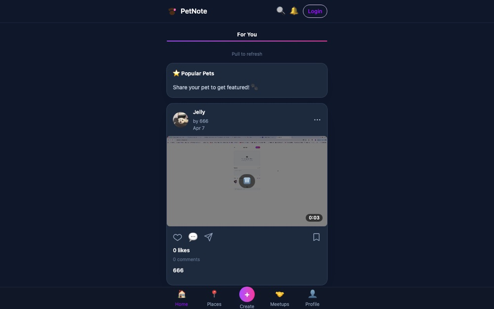

# PetNote

[](https://github.com/renrenmimi/PetNote/actions/workflows/ci.yml)

A pet-focused social web application with posts, shared pet profiles, place reviews and check-ins, meetups, notifications, and moderation tools.

**Live demo:** https://petnote.vercel.app



## Features

- Image and video posts with comments, replies, likes, bookmarks, and hashtags
- Pet profiles shared with family members through single-use invitation codes
- Pet-friendly places with reviews, photos, and check-ins
- Meetups with capacity, eligibility, and private-address controls
- Real-time notifications and administrative moderation
- Account deletion with retryable cleanup across related data

## Architecture

The React client reads through Firestore security rules. Most business writes go through callable Cloud Functions, where validation, identity checks, transactions, and rate limits are applied. Firestore triggers maintain derived counters and notification fan-out.

| Layer     | Technology                                             |
| --------- | ------------------------------------------------------ |
| Frontend  | React 19, TypeScript, Vite, Tailwind CSS, React Router |
| Backend   | Firebase Auth, Firestore, Cloud Functions v2           |
| Media     | Cloudinary signed uploads                              |
| Geocoding | Geoapify through Cloud Functions                       |
| Quality   | Vitest, ESLint, strict TypeScript                      |

## Security notes

- Firestore rules limit direct client writes and validate permitted fields.
- Callable functions re-check identity, roles, bans, and deletion state.
- Invitation redemption and counter updates use transactions.
- Account deletion uses a temporary tombstone to prevent profile recreation during cleanup.

More detail is available in [SECURITY_MODEL.md](SECURITY_MODEL.md), [TECH_REPORT.md](TECH_REPORT.md), and [QA_TESTING.md](QA_TESTING.md).

## Running locally

Prerequisites: Node 22, npm, Firebase, Cloudinary, and Geoapify credentials.

```bash
npm install
npm --prefix functions install
cp .env.example .env.local
npm run dev
npm test
npm run lint
npm run build
```

Backend secrets are stored with Firebase Secret Manager and are not included in the client bundle.
