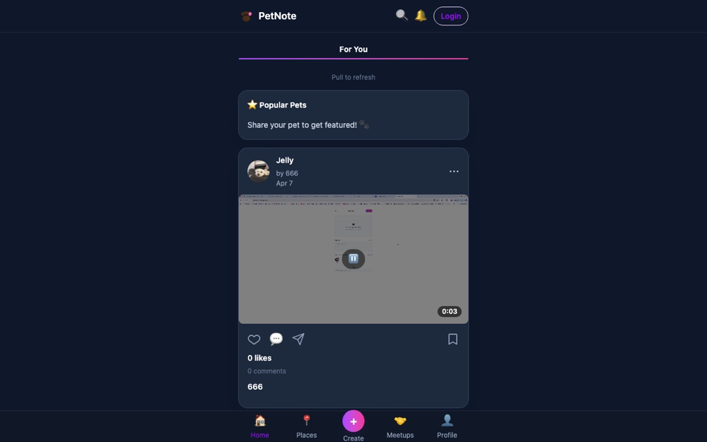
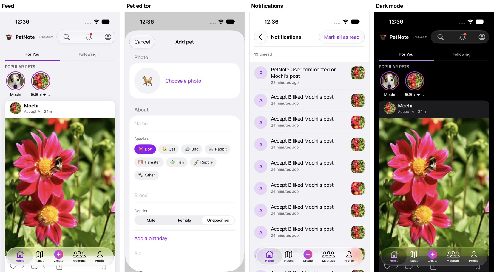

# PetNote

[](https://github.com/renrenmimi/PetNote/actions/workflows/ci.yml)

A pet-focused social web application with posts, shared pet profiles, place reviews and check-ins, meetups, notifications, and moderation tools.

**Live demo:** https://petnote.vercel.app



## Features

- Image and video posts with comments, replies, likes, bookmarks, and hashtags
- Pet profiles shared with family members through single-use invitation codes
- Pet-friendly places with reviews, photos, and check-ins
- Meetups with capacity, eligibility, and private-address controls
- Real-time notifications and administrative moderation
- Account deletion with retryable cleanup across related data

## Architecture

The React client reads through Firestore security rules. Most business writes go through callable Cloud Functions, where validation, identity checks, transactions, and rate limits are applied. Firestore triggers maintain derived counters and notification fan-out.

| Layer     | Technology                                             |
| --------- | ------------------------------------------------------ |
| Frontend  | React 19, TypeScript, Vite, Tailwind CSS, React Router |
| Backend   | Firebase Auth, Firestore, Cloud Functions v2           |
| Media     | Cloudinary signed uploads                              |
| Geocoding | Geoapify through Cloud Functions                       |
| Quality   | Vitest, ESLint, strict TypeScript                      |

## Native iOS app

A native iPhone client, written in Swift with SwiftUI, lives in [`ios-native/`](ios-native/). It uses the same Firebase backend as the web app, through the same security rules and callable functions. It is in testing and not yet on the App Store.



- The web app's main screens: email and Google sign-in; the feed with For You and Following, Popular Pets and birthday banners; posts with comments, likes, bookmarks and sharing; pets shared with family members; profiles, search and notifications; places and meetups; settings and account deletion. English and Chinese.
- Swift 6 language mode with complete strict concurrency checking.
- More than 900 unit tests (Swift Testing) and more than 150 UI tests (XCUITest), run against the Firebase emulators. CI builds the app and runs the unit tests on every change under `ios-native/`.
- Accessibility is tested rather than assumed: touch targets of at least 44pt at the smallest and the largest text sizes, a VoiceOver label on every control along the core path, and text contrast measured on the rendered screens.

Setup and project notes are in [`ios-native/README.md`](ios-native/README.md). Progress against the web app, feature by feature, is tracked in [`STATUS.md`](STATUS.md) (in Chinese).

## Security notes

- Firestore rules limit direct client writes and validate permitted fields.
- Callable functions re-check identity, roles, bans, and deletion state.
- Invitation redemption and counter updates use transactions.
- Account deletion uses a temporary tombstone to prevent profile recreation during cleanup.

More detail is available in [SECURITY_MODEL.md](SECURITY_MODEL.md), [TECH_REPORT.md](TECH_REPORT.md), and [QA_TESTING.md](QA_TESTING.md).

## Running locally

Prerequisites: Node 22, npm, Firebase, Cloudinary, and Geoapify credentials.

```bash
npm install
npm --prefix functions install
cp .env.example .env.local
npm run dev
npm test
npm run lint
npm run build
```

Backend secrets are stored with Firebase Secret Manager and are not included in the client bundle.
